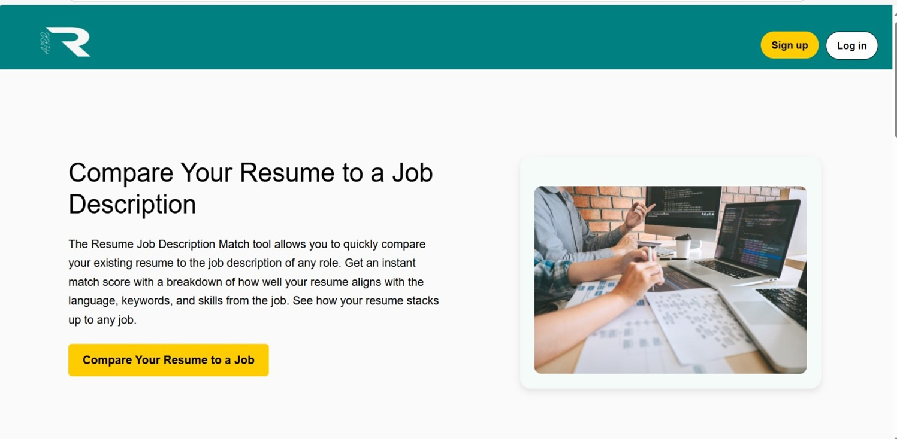

<<<<<<< HEAD
# AIRRR - AI Enabled Resume Recommendation System

AIRRR (AI-Enabled Intelligent Resume Recommendation & Ranking) is an end-to-end tool designed for recruiters to analyze, score, and recommend job candidates based on their resumes using NLP and AI techniques. It streamlines the hiring process by automatically parsing resumes, matching them to job descriptions, and recommending top-fit candidates.

---

## 🧠 Key Features

- ✅ **Resume Parser**: Extracts candidate details like name, contact info, skills, experience using custom spaCy models.
- 🎯 **Keyword Matching**: Scores resumes based on how well the candidate's profile matches job requirements.
- 🤖 **Recommendation Engine**: Uses AI models like Doc2Vec, Random Forest, and Cosine Similarity to rank candidates.
- 🌐 **Web Interface**: Built with **React + Vite** for a clean and fast frontend.
- ⚡ **FastAPI Backend**: Handles the resume processing pipeline efficiently.
- ☁️ **AWS S3 Integration**: Stores resumes and job descriptions securely.
- 🧾 **Custom Dataset**: Created personalized `.jsonl` files for training models on resume and JD matching.

---

## 📸 Screenshots
### 🖼️ Website Interface

### 📊 Model Accuracy Output
### matching

### Extraction 

## prediction / categorized
 

---

## ⚙️ Tech Stack

| Component       | Technology       |
|----------------|------------------|
| Frontend       | React + Vite     |
| Backend        | FastAPI          |
| NLP Models     | spaCy (custom NER), TF-IDF, Doc2Vec |
| Classifier     | Random Forest    |
| Similarity     | Cosine Similarity|
| Database       | MongoDB          |
| File Storage   | AWS S3           |

---

## 📂 Project Modules Overview

### 1. **Resume Parser**
- Built using **custom spaCy pipeline**
- Extracts:
  - Name
  - Contact
  - Skills
  - Experience
  - Education

### 2. **Keyword Matching**
- Compares extracted entities with job description
- Uses TF-IDF and token similarity
- Calculates keyword score for candidate ranking

### 3. **Recommendation Engine**
- Combines:
  - Doc2Vec for semantic similarity
  - Random Forest for classification
  - Cosine Similarity for matching strength
- Ranks candidates based on their fit for the job

---

=======
# AIRRR
>>>>>>> c14455ed1ff527a0dc0925c04302ff6f7e86b254
